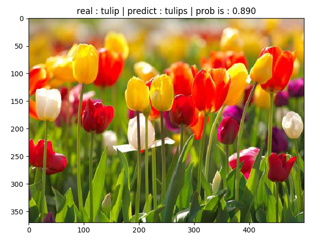
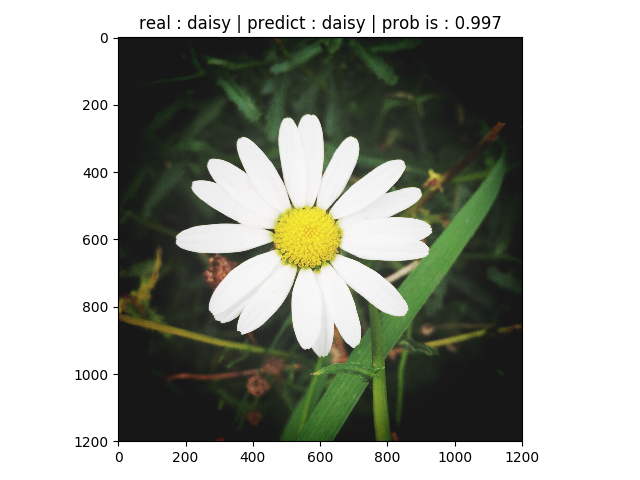
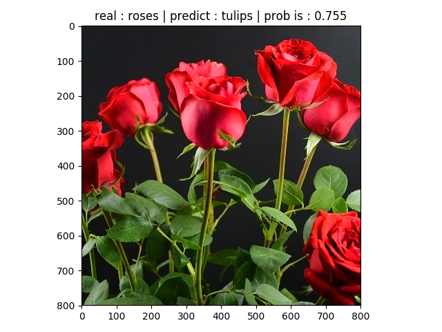

>此仓库移至https://github.com/codecat0/CV

## 经典图像分类网络

### 1. 代码结构
```
|--models ：各个模型pytorch实现代码
|   |--alexnet.py
|   |--vggnet.py
|   |--googlenet.py
|   |--resnet.py
|   |--densenet.py
|   |--mobilenetv2.py
|   |--mobilenetv3.py
|   |--shufflenet.py
|   |--shufflenetv2.py
|   |--ghostnet.py
|   |--vit.py
|--utils ：配置文件
|   |--data_utils.py ：数据预处理
|   |--train_val_utils.py : 模型训练
|--AlexNet ：AlexNet网络训练和预测代码
|--VGGNet ： VGGNet网络训练和预测代码
|--GoogLeNet : GoogLeNet网络训练和预测代码
|--ResNet : ResNet网络训练和预测代码
|--DenseNet : DenseNet网络训练和预测代码
|--vision_transformer : VIT网络训练和预测代码
```

### 2. 数据集
http://download.tensorflow.org/example_images/flower_photos.tgz

### 3. 模型详解
- **AlexNet :** https://blog.csdn.net/qq_42735631/article/details/115800315
- **VGGNet :** https://blog.csdn.net/qq_42735631/article/details/116071166
- **GoogLeNet :** https://blog.csdn.net/qq_42735631/article/details/116404840
- **ResNet :** https://blog.csdn.net/qq_42735631/article/details/116803066
- **DenseNet :** https://blog.csdn.net/qq_42735631/article/details/116861074
- **MobileNet :**
- **ShuffleNet :**
- **GhostNet :**
- **VIT :**

### 4. 模型测试
下图为`VIT`模型测试结果：


】

从第三张图，我们可以看出这个模型将`rose`识别为`tulip`，并且以`75.5%`的概率认定其为`tulip`，可以看出这个模型还有待改善。
针对于`rose`和`tulip`这种相似图像的分类任务，可以采取`细粒度分类`
